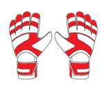
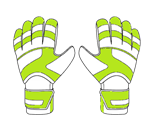

# Goalkeeper Game

학부 수업에서 진행한 Pygame 기반 골키퍼 미니게임입니다. 골대 안에서 장갑 커서를 움직여 날아오는 공을 막고, 점수에 따라 빨라지는 슛에 도전합니다.

## 프로젝트 정보

| 항목 | 내용 |
| --- | --- |
| 진행 시기 | 2024년 3학년 1학기 |
| 과목 | 파이썬 프로그래밍 |

## Item gallery

### Stadiums

<table>
  <tr>
    <th>Stadium 1</th>
    <th>Stadium 2</th>
    <th>Stadium 3</th>
  </tr>
  <tr>
    <td align="center"></td>
    <td align="center"></td>
    <td align="center"></td>
  </tr>
</table>

### Gloves

<table>
  <tr>
    <th>Glove 1 · Slower shots</th>
    <th>Glove 2 · Wider save area</th>
    <th>Glove 3 · Extra life</th>
  </tr>
  <tr>
    <td align="center"></td>
    <td align="center"></td>
    <td align="center"></td>
  </tr>
</table>

## Gameplay

| 1. 메인 / 시작 화면 | 2. 아이템 선택 화면 | 3. 게임 플레이 화면 |
| :---: | :---: | :---: |
|  |  |  |

## Features

- 사용자 이름 입력과 로컬 Top 10 랭킹
- 경기장, 공, 골키퍼 장갑 선택
- 점수에 따른 `easy` → `normal` → `hard` 난이도 변화
- 장갑별 능력
  - 1번 장갑: 공의 속도 감소
  - 2번 장갑: 더 넓은 선방 범위
  - 3번 장갑: 기본 생명 3개 대신 4개
- 프로젝트 위치와 무관하게 동작하는 상대 경로 기반 에셋 로딩

## Run

Python을 설치한 뒤 이 폴더에서 다음 명령을 실행합니다.

```bash
python -m venv .venv
python -m pip install -r requirements.txt
python main.py
```

## How to play

1. `Items`에서 경기장, 공, 장갑을 선택합니다.
2. `Start`를 누르고 사용자 이름을 입력합니다.
3. 골대 영역 안에서 마우스를 움직여 공이 커졌을 때 장갑으로 막습니다.
4. 공을 놓칠 때마다 생명이 하나 줄며, 생명을 모두 잃으면 점수가 랭킹에 저장됩니다.

게임 중 `Esc` 또는 우측 상단 `Exit` 버튼으로 현재 점수를 저장하고 메인 메뉴로 돌아갈 수 있습니다.

## Structure

```text
pygame-goalkeeper-game/
├─ assets/          # 경기장, 공, 장갑, 키커 이미지
├─ data/            # 실행 중 생성되는 선택 설정과 랭킹
├─ docs/images/     # README용 플레이 이미지
├─ main.py          # 메뉴, 게임 루프, 충돌 처리, 데이터 저장
└─ requirements.txt
```

## Repository notes

- 이미지 경로는 프로젝트 폴더를 기준으로 계산하므로 설치 위치와 관계없이 실행할 수 있습니다.
- 필요한 Python 패키지는 `requirements.txt`에서 관리합니다.
- `data/selection.json`과 `data/ranking.tsv`는 실행 중 자동으로 생성되는 사용자 데이터이며 Git에서 제외됩니다.
- Python 캐시, 가상 환경과 실행 데이터는 `.gitignore`에 포함했습니다.
